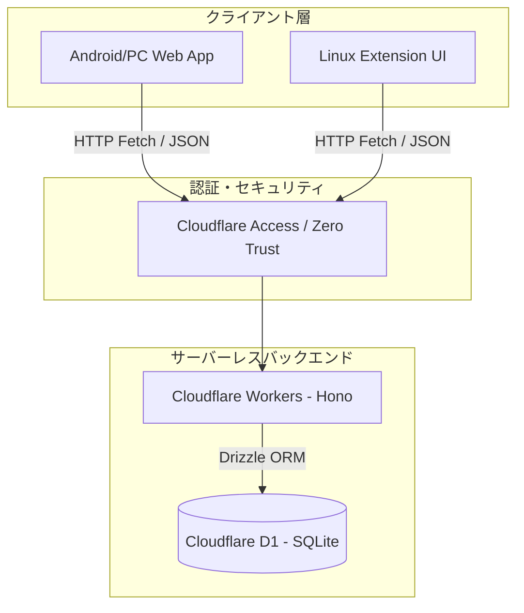

# クラウド同期型アーキテクチャ（Cloudflare Workers + D1）への移行ロードマップ

## 1. 目的 (Objective)

Linux ブラウザ拡張機能と Android Chrome（Web アプリ）間でのブックマークおよびキーワードデータのシームレスな同期・共有を最優先事項とします。
これまでの Local-first (Messaging Bridge + IndexedDB) 構成から、**Cloudflare Workers + D1 (SQLite)** をデータマスターとした「クラウド同期型アーキテクチャ」へ移行し、マルチデバイスでのリアルタイム同期を実現します。

## 2. アーキテクチャの変遷 (Architecture Evolution)

### 現行アーキテクチャ (Local-first v2.0 - 仕掛かり)

- **Web アプリ / 拡張機能 UI** -> `ApiClient` インターフェース -> `ExtensionApiClient` (メッセージング) -> `background.ts` -> `IndexedDB` (Drizzle)
- データの正解（マスター）は拡張機能内の IndexedDB に存在し、Web アプリは拡張機能がないと動作しない。Android Chrome 等の拡張機能非対応環境で利用不可。

### 移行後アーキテクチャ (Cloud Sync v1.0)

- **クライアント共通**: `ApiClient` インターフェース -> `HttpApiClient` (Fetch API) -> `Cloudflare Workers`
- データの正解（マスター）をクラウドの D1 上に置き、デバイス間で共有。
- 個人専用 of データ保護のため、Cloudflare Zero Trust (Access) による認証レイヤーを挟む。

## 3. 移行ベースブランチの決定

本移行は **`develop/local-first` ブランチ** をベースに開発を再開します。

### 理由:

1. **通信層の抽象化**: すでに `ApiClient` インターフェースが定義されており、UI やカスタムフック（`useBookmarkPage` 等）から具象実装が隠蔽されているため、`HttpApiClient` を実装して差し替えるだけで移行が可能。
2. **高品質なテスト資産**: 確立された「黄金パターン」テスト群を MSW (Mock Service Worker) による HTTP モックへ移行することで、UI ロジックのデグレードを完全に防ぐことができる。
3. **最新スキーマの継承**: `shared/schemas/` にある洗練された Zod スキーマをそのまま D1 / Workers でのバリデーションおよびテーブル定義に流用できる。

---

## 4. 実装フェーズ (Implementation Steps)

### フェーズ 1: バックエンド構築 (Workers + D1)

- [ ] **[Backend] D1 データベースのセットアップ**:
  - `drizzle.config.ts` を D1 向けに設定。
  - `shared/schemas/` の Zod スキーマを元に、D1 (SQLite) 用のテーブル定義を作成。
- [ ] **[Backend] Hono API の実装**:
  - 旧 `server/` 配下の Hono ルーティング資産を参考に、Workers 上で動作する軽量な CRUD API を構築。
  - Zod スキーマを用いたリクエスト/レスポンスの厳格なバリデーション。
- [ ] **[Backend] 認証の統合**:
  - Cloudflare Access 経由で付与される JWT などの認証ヘッダーを検証するミドルウェアの導入。

### フェーズ 2: クライアント通信層の実装と切り替え

- [ ] **[Shared] 定数・エラーコードの整理**:
  - HTTP 通信用のアクション、エンドポイント、HTTP ステータスコードに基づくエラー定義を `shared/constants.ts` に集約。
- [ ] **[Frontend] `HttpApiClient` の新規実装**:
  - `ApiClient` インターフェースを実装し、`fetch` または Hono Client (`hc`) を用いて Workers API と通信するクライアントを作成。
- [ ] **[Frontend] `ApiProvider` のアップデート**:
  - `ExtensionApiClient` から `HttpApiClient` へ切り替え。設定（API URL や認証情報）を環境変数および LocalStorage から取得するロジックを実装。

### フェーズ 3: テスト基盤の HTTP 移行（黄金パターンの維持）

- [ ] **[Test] MSW (Mock Service Worker) の導入**:
  - `src/test/messaging.ts` (メッセージングブリッジのモック) に代わり、MSW を用いた API モックサーバーを設定。
- [ ] **[Test] `useBookmarkPage` テスト群の復旧**:
  - 確立された「黄金パターン」の検証メソッド（`verifySuccess`, `verifyError` 等）を MSW 向けに書き換え。
  - テストが HTTP 経由で 100% パスすることを確認。
- [ ] **[Test] 仕掛かり中テストの完了**:
  - `useKeywordPage` の残りテストを同様のパターンで実装・復旧。

### フェーズ 4: デプロイとデータ移行

- [ ] **[Infra] Cloudflare Pages / Workers デプロイ**:
  - Wrangler を用いた本番環境へのデプロイ設定。
- [ ] **[Data] 移行スクリプトの作成**:
  - 既存の SQLite (または IndexedDB) のデータをエクスポートし、D1 へインポートするためのスクリプト。
- [ ] **[Cleanup] 不要な拡張機能固有コードの整理**:
  - 必要に応じて、`extension/` 配下の IndexedDB 処理など、不要になったローカル専用コードをクリーンアップ（将来的なハイブリッド同期用に残す場合はモジュール化して無効化）。

---

## 5. 技術・セキュリティ基準 (Technical Standards)

- **SSRF対策**: Web アプリから Workers にアクセスする際、API エンドポイントのバリデーションを行い、ループバックアドレス等への不正リクエストを防ぐ。
- **Zod バリデーション**: D1 への書き込み、および API レスポンスの受け取りの双方で Zod による厳格な型チェックを行い、データの不整合を防ぐ。
- **リソース管理**: `AbortController` によるタイムアウト処理をすべての API リクエストに実装する。
